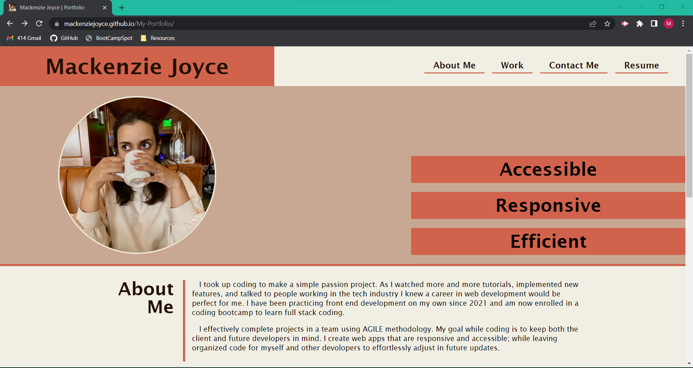
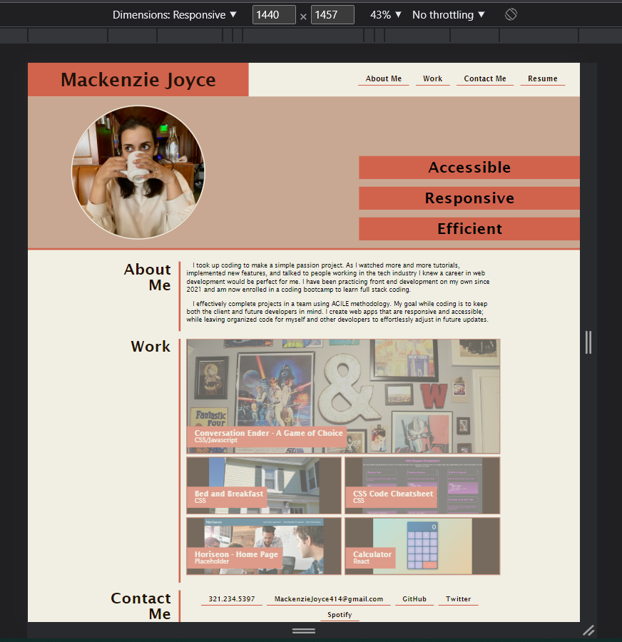
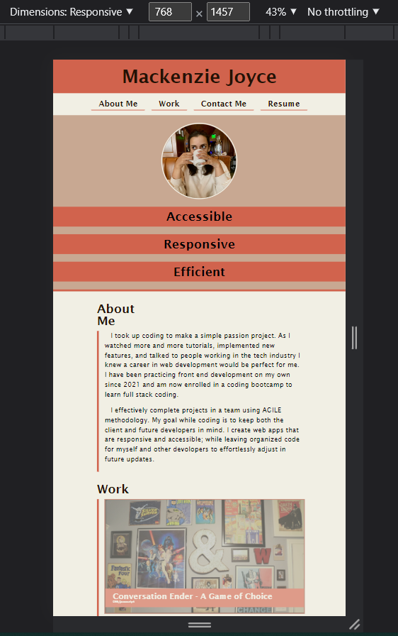
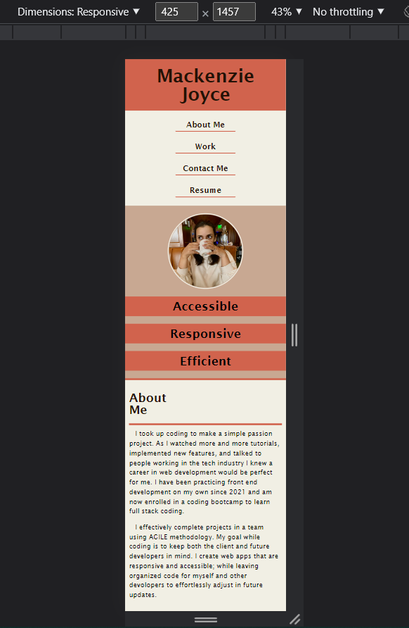
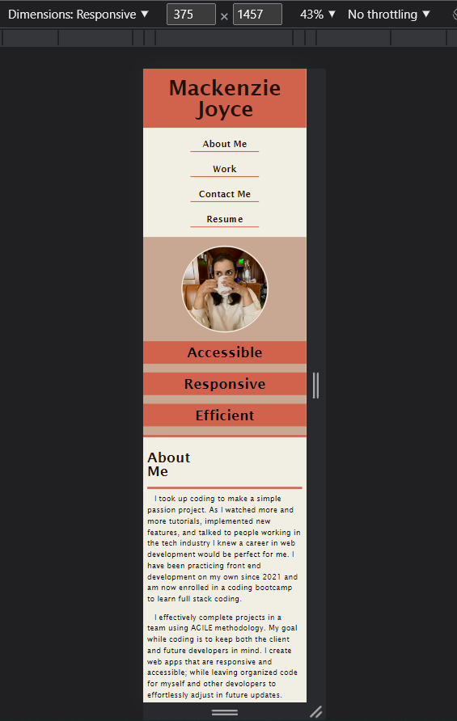

# My Portfolio

This repository holds the files for a personal portfolio. The links in the nav bar direct the visitor to different sections on the page. The "Work" section showcases the projects I have made or hope to complete. These showcases also link to the live URLs for those projects. Besides the nav bar, every link opens in a new tab of the visitors browser. When viewed at different dimensions the content adjusts itself.

Link to the live site:
https://mackenziejoyce.github.io/Mackenzie-Joyce-Portfolio/

Screenshots at different dimensions:

When you open the window

Laptop: 1440 x 1457  

Tablet: 768 X 1457

Large mobile: 425 x 1457

Medium mobile: 375 X 1457

